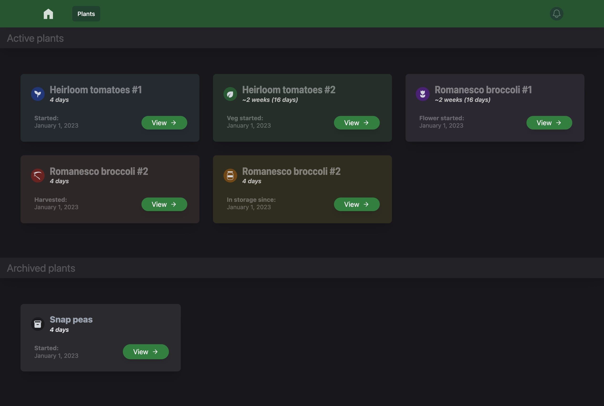
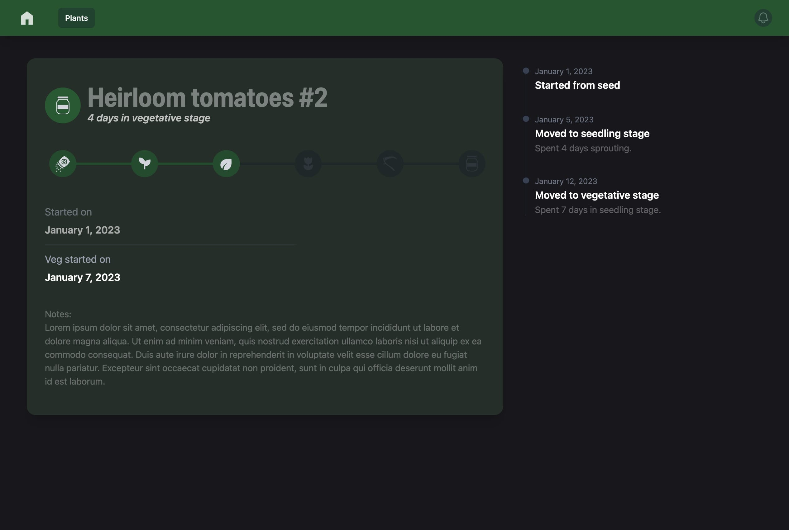

# Plant Tracker frontend

Vue.js frontend for my [Plant Tracker API backend](https://github.com/jesse-kaufman/plantsdb) using Tailwind CSS.

Currently in the building phase. Mockups can be found in the mockup directory.

## Screenshots

### Plant list view

### Plant detail view

---

## Progress

- [x] Mockup pages
- [x] Create Vue.js components – *in progress*
  - [x] Create main layout components
  - [x] Create components for plant view
  - [x] Create components for plant list
- [x] Refactor to use Vue.js router
- [ ] Refactor to use json-server for mock API backend (read-only)
- [ ] Add ability to create and make changes to plants via mock API
- [ ] Build Docker container for easy deployment of client + server
- [ ] Setup CI/CD for Docker container
